  <!-- Header Banner / Typing SVG -->
  

  

    Transformando processos em automações eficientes, integrando ecossistemas via REST e construindo soluções escaláveis. 
    <b>Desenvolvedor de Sistemas</b> no <b>Grupo Malwee</b> · Cursando <b>Engenharia de Software</b> na Católica SC.
  

  

    
    &nbsp;
    
  

 

<!-- ==================== WHOAMI & IDENTITY (BENTO GRID) ==================== -->
<table>
  <tr>
    <td width="42%" align="center" valign="middle">
      
    </td>
    <td width="58%" valign="top">
      
    </td>
  </tr>
</table>

 

<!-- ==================== AUTOMATED CONTRIBUTIONS HEATMAP ==================== -->

  <h3><code>pedro@github ~ $ ./contributions.sh</code></h3>
  
    
  

 

<!-- ==================== TECH STACK (SKILL ICONS) ==================== -->
## 🛠️ Stack & Tecnologias

  
<b>Linguagens & Ecossistema</b>

  

    

  
<b>Back-end, Bancos & Ferramentas</b>

  

    

  
<b>Front-end, Cloud & Automação</b>

  

 

<!-- ==================== FEATURED PROJECTS (CARDS WITH PREVIEWS) ==================== -->
## 🚀 Projetos em Destaque

<table width="100%">
  <tr>
    <td width="50%" valign="top">
      
      <h3>📐 Gerenciador de Medidas (SPA)</h3>
      
Aplicação web interativa com <b>Vanilla JS (ES6+)</b> e arquitetura <b>MVC</b>, demonstrando domínio dos fundamentos da web moderna sem depender de frameworks.

      

        
        
        
      

      

        
        &nbsp;
        
      

    </td>
    <td width="50%" valign="top">
      
      <h3>⚡ Glossário de Componentes Eletrônicos</h3>
      
Guia interativo de referência técnica para componentes Arduino com foco em semântica, responsividade e layout com CSS3 avançado.

      

        
        
      

      

        
        &nbsp;
        
      

    </td>
  </tr>
  <tr>
    <td colspan="2" valign="top">
      <h3>🏭 Textile Production API (Full-Stack & DevOps)</h3>
      
API RESTful robusta para registros de produção industrial têxtil em larga escala. Desenvolvida com arquitetura em camadas, testes automatizados e containerização total.

      

        
        
        
        
        
      

      

        
      

    </td>
  </tr>
</table>

 

<!-- ==================== EXPERIENCE TIMELINE ==================== -->
## 💼 Experiência Profissional

<table>
  <tr>
    <td align="center" width="80" valign="middle">
      
    </td>
    <td>
      <b>Desenvolvedor de Sistemas · Grupo Malwee</b> <i>(Out 2025 – Presente)</i> 
      Atuação no desenvolvimento de automações internas, criação de chatbots e integrações entre ecossistemas via REST API. 
      <code>Node.js</code> <code>TypeScript</code> <code>Python</code> <code>N8N</code> <code>Docker</code> <code>PostgreSQL</code> <code>REST APIs</code>
    </td>
  </tr>
  <tr>
    <td align="center" width="80" valign="middle">
      
    </td>
    <td>
      <b>Programador de Sistemas · Grupo Malwee</b> <i>(Jan 2024 – Out 2025)</i> 
      Desenvolvimento de scripts em Python/JS, automação de processos repetitivos e suporte a sistemas legados e modernos. 
      <code>Python</code> <code>JavaScript</code> <code>Automações</code> <code>Suporte a Sistemas</code>
    </td>
  </tr>
  <tr>
    <td align="center" width="80" valign="middle">
      
    </td>
    <td>
      <b>Montador de Painéis Elétricos · Axtun</b> <i>(Abr 2023 – Jan 2024)</i> 
      Montagem de circuitos, raciocínio lógico estruturado e diagnóstico/debugging de hardware e sistemas.
    </td>
  </tr>
  <tr>
    <td align="center" width="80" valign="middle">
      
    </td>
    <td>
      <b>Estagiário Projetista Elétrico · Projecamp</b> <i>(Mar 2022 – Abr 2023)</i> 
      Planejamento, modelagem de requisitos e documentação técnica de projetos industriais.
    </td>
  </tr>
</table>

 

---

  Desenvolvido com 💚 por <b>Pedro Martins do Nascimento</b>

