  <!-- Typing SVG Hero Header -->
  

  

    <strong>Transformando regras de negócio em automações eficientes, integrando ecossistemas via REST e desenvolvendo APIs escaláveis.</strong>
  

  <!-- Quick Action & Connect Pills (sem underlines) -->
  

      
  

---

<!-- ==================== BENTO GRID: ABOUT ME & FOCUS ==================== -->
<table width="100%">
  <tr>
    <td width="50%" valign="top">
      <h3>⚡ Sobre Mim</h3>
      <ul>
        <li>💼 <b>Desenvolvedor de Sistemas</b> no <a href="https://www.grupomalwee.com.br/"><b>Grupo Malwee</b></a>.</li>
        <li>🎓 Cursando <b>Engenharia de Software</b> na Católica de Santa Catarina (2025–2029).</li>
        <li>📍 Jaraguá do Sul, Santa Catarina — Brasil.</li>
        <li>🧠 Foco no desenvolvimento de <b>APIs RESTful</b>, arquitetura de software e automação de fluxos corporativos.</li>
        <li>💡 Entusiasta de Clean Architecture, testes automatizados e integração de Inteligência Artificial.</li>
      </ul>
    </td>
    <td width="50%" valign="top">
      <h3>🎯 Atuação & Foco Diário</h3>
      <ul>
        <li>🚀 <b>Back-end & Integrações:</b> Construção e manutenção de APIs com <b>Node.js</b>, <b>TypeScript</b> e <b>Python</b>.</li>
        <li>🤖 <b>Automação & Chatbots:</b> Orquestração de rotinas complexas com <b>N8N</b>, webhooks e mensageria.</li>
        <li>🗄️ <b>Banco de Dados & Infra:</b> Modelagem com <b>PostgreSQL</b> e containerização com <b>Docker</b>.</li>
        <li>🧪 <b>Qualidade & Performance:</b> Testes automatizados unitários e de carga com <b>Jest</b> e <b>K6</b>.</li>
      </ul>
    </td>
  </tr>
</table>

---

<!-- ==================== TECH STACK ==================== -->
## 🛠️ Stack & Tecnologias

| 💻 Linguagens & Core | ⚙️ Back-end & Bancos | 🎨 Frameworks & UI | 🤖 IA & Automação |
| :--- | :--- | :--- | :--- |
|       |       |       |       |

---

<!-- ==================== FEATURED PROJECTS ==================== -->
## 🚀 Projetos em Destaque

<table width="100%">
  <tr>
    <td width="50%" valign="top">
      
      <h3>📐 Gerenciador de Medidas (SPA)</h3>
      
Aplicação web interativa desenvolvida com <b>JavaScript puro (Vanilla JS)</b> e padrão de arquitetura <b>MVC</b>, demonstrando sólido domínio da base sem depender de frameworks externos.

      

        
        
        
      

      

        
        &nbsp;
        
      

    </td>
    <td width="50%" valign="top">
      
      <h3>⚡ Glossário de Componentes Eletrônicos</h3>
      
Guia interativo de referência técnica para componentes Arduino com foco em semântica, responsividade e layout estruturado com CSS3 moderno.

      

        
        
        
      

      

        
        &nbsp;
        
      

    </td>
  </tr>
  <tr>
    <td colspan="2" valign="top">
      <h3>🏭 Textile Production API (Full-Stack & DevOps)</h3>
      
API RESTful de nível industrial para controle de ordens e registros de produção têxtil. Desenvolvida com arquitetura em camadas, banco relacional PostgreSQL, suíte de testes unitários/integração com <b>Jest</b> e testes de carga extrema com <b>K6</b>.

      

        
        
        
        
        
        
      

      

        
      

    </td>
  </tr>
</table>

---

<!-- ==================== WORK EXPERIENCE ==================== -->
## 💼 Trajetória Profissional

<table width="100%">
  <tr>
    <td align="center" width="90" valign="middle">
      
    </td>
    <td>
      <b>Desenvolvedor de Sistemas · <a href="https://www.grupomalwee.com.br/">Grupo Malwee</a></b> <i>(Out 2025 – Presente)</i> 
      Atuação direta na automação de processos de negócio, desenvolvimento de chatbots corporativos e integrações robustas entre múltiplos sistemas via REST API. 
      <code>Node.js</code> <code>TypeScript</code> <code>Python</code> <code>N8N</code> <code>Docker</code> <code>PostgreSQL</code> <code>REST APIs</code>
    </td>
  </tr>
  <tr>
    <td align="center" width="90" valign="middle">
      
    </td>
    <td>
      <b>Programador de Sistemas da Informação · Grupo Malwee</b> <i>(Jan 2024 – Out 2025)</i> 
      Criação de scripts em Python e JavaScript para automação de tarefas manuais, suporte técnico especializado a sistemas internos e manutenção corretiva/evolutiva. 
      <code>Python</code> <code>JavaScript</code> <code>Automações</code> <code>Suporte a Sistemas</code> <code>Bancos Relacionais</code>
    </td>
  </tr>
  <tr>
    <td align="center" width="90" valign="middle">
      
    </td>
    <td>
      <b>Montador de Painéis Elétricos · <a href="https://axtun.com/">Axtun</a></b> <i>(Abr 2023 – Jan 2024)</i> 
      Montagem de circuitos e painéis industriais, debugging de componentes e desenvolvimento de forte raciocínio lógico e estruturado. 
      <code>Lógica de Sistemas</code> <code>Debugging de Hardware</code> <code>Atenção a Detalhes</code>
    </td>
  </tr>
  <tr>
    <td align="center" width="90" valign="middle">
      
    </td>
    <td>
      <b>Estagiário Projetista Elétrico · <a href="https://www.projecamp.com.br/">Projecamp</a></b> <i>(Mar 2022 – Abr 2023)</i> 
      Planejamento, levantamento de requisitos de engenharia e elaboração de documentação técnica detalhada. 
      <code>Análise de Requisitos</code> <code>Documentação Técnica</code> <code>Visão Sistêmica</code>
    </td>
  </tr>
</table>

---

<!-- ==================== GITHUB STATS & METRICS ==================== -->
## 📊 Estatísticas & Atividade no GitHub

  
  

    

  <h3><code>pedro@github ~ $ ./contributions.sh</code></h3>
  

 

---

  Construído com 💚 e precisão técnica por <b>Pedro Martins do Nascimento</b>

