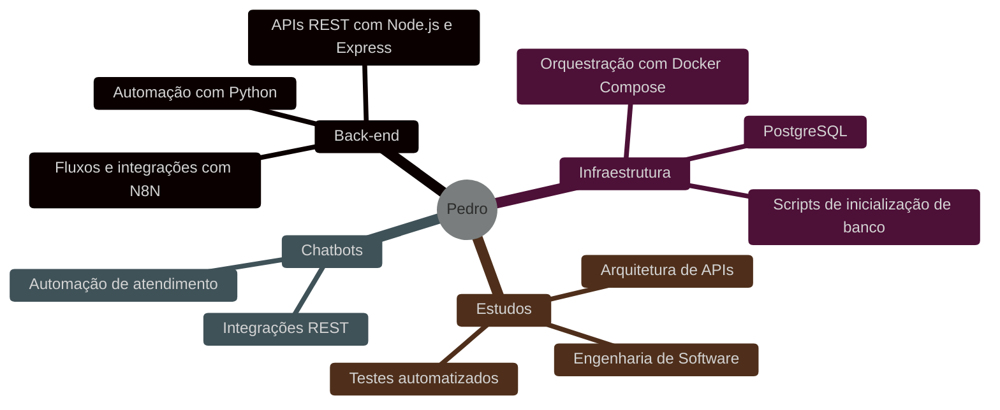
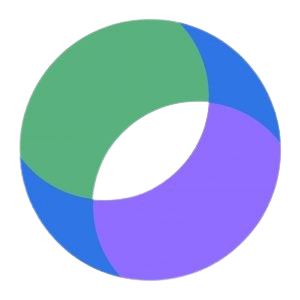

<!-- Início do README -->

<svg width="800" height="200" viewBox="0 0 800 200" xmlns="http://www.w3.org/2000/svg">
  <defs>
    <linearGradient id="bgGrad" x1="0%" y1="0%" x2="100%" y2="100%">
      <stop offset="0%" style="stop-color:#0d1117;stop-opacity:1" />
      <stop offset="100%" style="stop-color:#161b22;stop-opacity:1" />
    </linearGradient>
    <linearGradient id="lineGrad" x1="0%" y1="0%" x2="100%" y2="0%">
      <stop offset="0%" style="stop-color:#58a6ff;stop-opacity:0" />
      <stop offset="50%" style="stop-color:#58a6ff;stop-opacity:1" />
      <stop offset="100%" style="stop-color:#58a6ff;stop-opacity:0" />
    </linearGradient>
  </defs>
  <rect width="800" height="200" fill="url(#bgGrad)" rx="12"/>
  <rect x="0" y="195" width="800" height="2" fill="url(#lineGrad)"/>
  <circle cx="60" cy="40" r="2" fill="#58a6ff" opacity="0.4"/>
  <circle cx="120" cy="80" r="1.5" fill="#79c0ff" opacity="0.3"/>
  <circle cx="740" cy="40" r="2" fill="#58a6ff" opacity="0.4"/>
  <circle cx="680" cy="80" r="1.5" fill="#79c0ff" opacity="0.3"/>
  <circle cx="400" cy="20" r="1.5" fill="#58a6ff" opacity="0.25"/>
  <text x="400" y="90" font-family="'Segoe UI', Arial, sans-serif" font-size="36" font-weight="700" fill="#e6edf3" text-anchor="middle" letter-spacing="1">Pedro Martins do Nascimento</text>
  <text x="400" y="125" font-family="'Segoe UI', Arial, sans-serif" font-size="15" fill="#58a6ff" text-anchor="middle" letter-spacing="2">DESENVOLVEDOR DE SISTEMAS</text>
  <rect x="300" y="138" width="200" height="1" fill="url(#lineGrad)" opacity="0.5"/>
  <text x="400" y="162" font-family="'Segoe UI', Arial, sans-serif" font-size="13" fill="#8b949e" text-anchor="middle">Node.js · TypeScript · Python · N8N · Jaraguá do Sul, SC</text>
</svg>

 

Transformo processos em automações, integro sistemas via REST e construo chatbots que funcionam de verdade. 
Desenvolvedor de Sistemas no Grupo Malwee, cursando Engenharia de Software na Católica de Santa Catarina.

---

# Stack de Tecnologias

**Linguagens:**

  
  
  
  
  
  
  

**Ferramentas & Infraestrutura:**

  
  
  
  
  
  
  
  
  
  
  
  
  

---

# O que faço no dia a dia

---

# Experiência de Trabalho

<!-- Para adicionar uma nova entrada: copie um bloco abaixo, ajuste os dados e cole na posição cronológica correta -->

<table>
<tr>
<td valign="middle" align="center" width="140">
   
  <b>Out 2025 – Presente</b>
</td>
<td valign="middle" style="padding-left: 16px; padding-top: 12px">

**Desenvolvedor de Sistemas · [Grupo Malwee](https://www.grupomalwee.com.br/) · Efetivo**

Atuação com automação de processos internos, desenvolvimento de chatbots e integrações entre sistemas via REST API.

`Node.js` `TypeScript` `Python` `N8N` `REST APIs` `Chatbots` `Automação de Processos` `Docker`

</td>
</tr>
<tr>
<td valign="middle" align="center" width="140">
   
  <b>Jan 2024 – Out 2025</b>
</td>
<td valign="middle" style="padding-left: 16px; padding-top: 12px">

**Programador de Sistemas da Informação · [Grupo Malwee](https://www.grupomalwee.com.br/) · Jovem Aprendiz**

Desenvolvimento de scripts, automação de tarefas e suporte a sistemas internos da empresa.

`Python` `JavaScript` `Automação de Tarefas` `Suporte a Sistemas` `Resolução de Bugs`

</td>
</tr>
<tr>
<td valign="middle" align="center" width="140">
   
  <b>Abr 2023 – Jan 2024</b>
</td>
<td valign="middle" style="padding-left: 16px; padding-top: 12px">

**Montador de Painéis Elétricos · [Axtun](https://axtun.com/) · Efetivo**

Montagem e debugging de painéis elétricos industriais, desenvolvendo raciocínio lógico e atenção a detalhes.

`Lógica de Sistemas` `Debugging de Hardware` `Atenção a Detalhes`

</td>
</tr>
<tr>
<td valign="middle" align="center" width="140">
   
  <b>Mar 2022 – Abr 2023</b>
</td>
<td valign="middle" style="padding-left: 16px; padding-top: 12px">

**Estagiário Projetista Elétrico · [Projecamp](https://www.projecamp.com.br/) · Estágio**

Apoio no planejamento e documentação de projetos elétricos industriais.

`Análise de Requisitos` `Documentação Técnica` `Visão Sistêmica`

</td>
</tr>
</table>

 

Perfil completo com certificações e recomendações no [LinkedIn](https://www.linkedin.com/in/pedro-martins-do-nascimento-a83680226/).

---

# Projetos em Destaque

<table width="100%">
  <tr>
    <td width="50%" valign="top">
      
      <h3>Gerenciador de Medidas (SPA)</h3>
      
Aplicação web com <strong>JavaScript puro (Vanilla JS)</strong> e arquitetura <strong>MVC</strong>, demonstrando domínio dos fundamentos da web sem dependência de frameworks.

      
<strong>Tecnologias:</strong> <code>JavaScript (ES6+)</code> <code>Tailwind CSS</code> <code>HTML5</code>

      
      
    </td>
    <td width="50%" valign="top">
      
      <h3>Glossário de Componentes Eletrônicos</h3>
      
Site estático desenvolvido em equipe como projeto acadêmico — guia de referência para componentes Arduino com <strong>HTML5 semântico e CSS3 puro</strong>.

      
<strong>Tecnologias:</strong> <code>HTML5</code> <code>CSS3</code>

      
      
    </td>
  </tr>
</table>

---

# GitHub Stats

  
  &nbsp;&nbsp;&nbsp;
  
  &nbsp;&nbsp;&nbsp;
  

---

# Entre em Contato

  

<!-- Fim do README -->